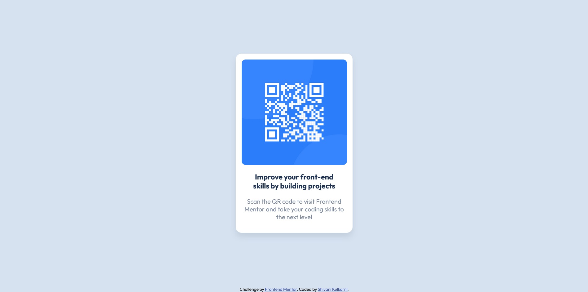

# Frontend Mentor - QR code component solution

This is a solution to the [QR code component challenge on Frontend Mentor](https://www.frontendmentor.io/challenges/qr-code-component-iux_sIO_H).

## Table of contents

- [Overview](#overview)
  - [Screenshot](#screenshot)
  - [Links](#links)
- [My process](#my-process)
  - [Built with](#built-with)
  - [What I learned](#what-i-learned)
- [Author](#author)

## Overview

This is a straightforward exercise to build a component that displays a QR code image.

### Screenshot

### Links

- Solution URL: https://github.com/shivani16kulkarni/fem-qr-code
- Live Site URL:https://shivani16kulkarni.github.io/fem-qr-code/

## My process

### Built with

- Semantic HTML5 markup
- CSS custom properties
- Flexbox

### What I learned

I got to practise my CSS Flexbox skills.

## Author

- Frontend Mentor - @shivani16kulkarni, https://www.frontendmentor.io/profile/shivani16kulkarni
